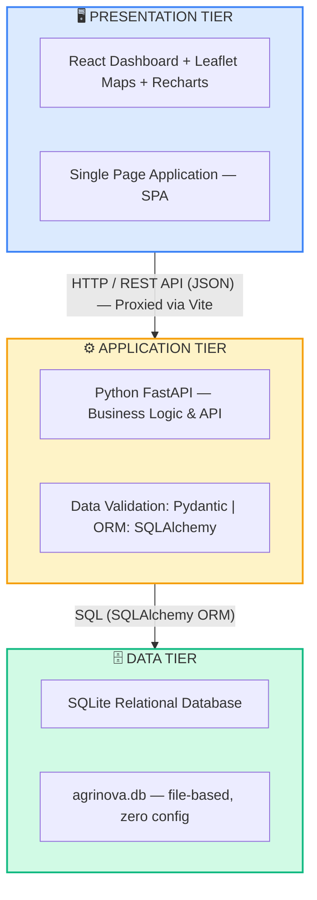
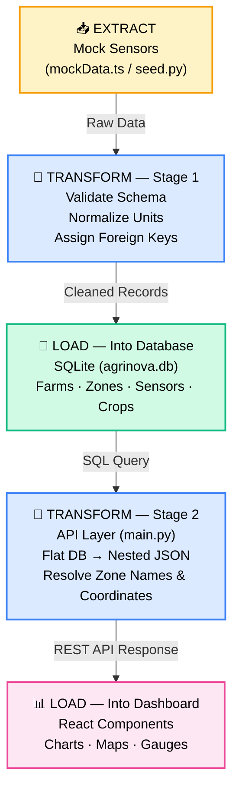
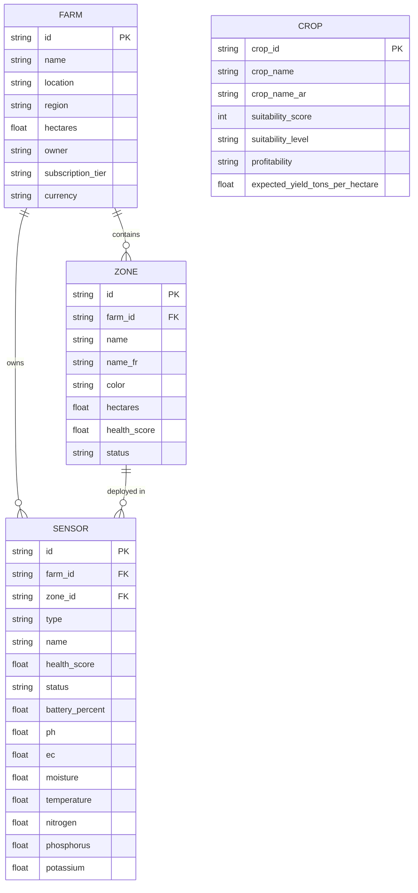
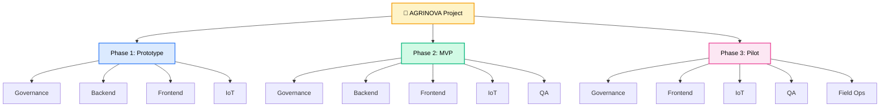
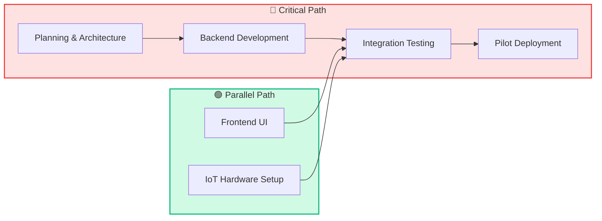
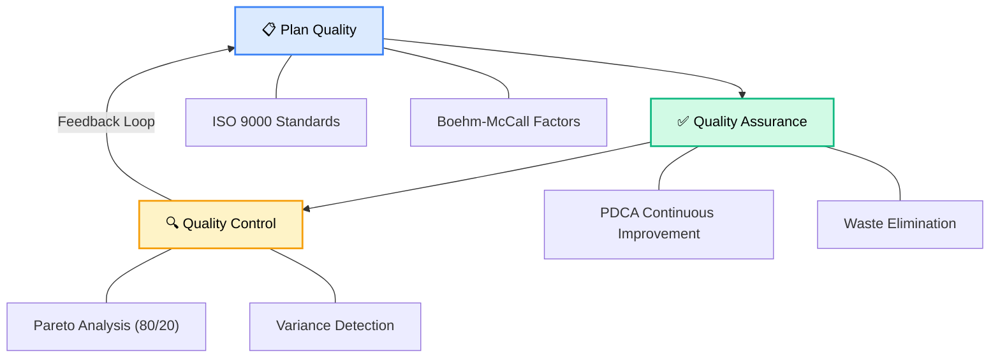

# 🌾 AGRINOVA — Agricultural Information System

> **An intelligent decision-support information system for precision agriculture, built around a complete ETL (Extract–Transform–Load) pipeline that collects soil sensor data, structures it into a relational database, and delivers actionable insights through an interactive analytical dashboard.**

---

## Table of Contents

1. [Project Overview](#1-project-overview)
2. [System Objectives](#2-system-objectives)
3. [Information System Architecture](#3-information-system-architecture)
4. [The ETL Process](#4-the-etl-process)
5. [Data Model & Database Design](#5-data-model--database-design)
6. [The Dashboard & User Interface](#6-the-dashboard--user-interface)
7. [Technical Stack](#7-technical-stack)
8. [Project Structure](#8-project-structure)
9. [Installation & Setup](#9-installation--setup)
10. [API Reference](#10-api-reference)
11. [Future Roadmap](#11-future-roadmap)
12. [Project Management](#12-project-management)

---

## 1. Project Overview

**Agrinova** is a full-stack **Agricultural Information System (AIS)** designed to support farm managers in making data-driven decisions about soil health, nutrient management, and crop planning. The system is contextualized for North African agriculture (specifically Algeria) and presents its interface in Arabic with bilingual data labels.

In the absence of physical IoT sensors during the development phase, the system simulates the complete data pipeline using **structured mock data** that mirrors the exact format and schema that real-world multi-parameter soil sensors would produce. This design choice ensures that transitioning to real sensor hardware requires **zero changes** to the database schema, API layer, or frontend interface.

---

## 2. System Objectives

The Agrinova Information System was designed to fulfill the following objectives:

| Objective | Description |
|---|---|
| **Data Centralization** | Consolidate all farm, zone, sensor, and crop data into a single relational database, replacing scattered spreadsheets and manual records. |
| **ETL Pipeline Implementation** | Demonstrate a functioning Extract–Transform–Load workflow that ingests raw sensor readings and delivers clean, query-ready data to the presentation layer. |
| **Decision Support** | Provide farm managers with real-time visualization of soil health indicators (pH, EC, NPK, moisture, temperature) to guide irrigation, fertilization, and crop rotation decisions. |
| **Spatial Awareness** | Offer a geospatial map view of the farm, enabling zone-level monitoring with health-based color coding. |
| **Scalability** | Architect the system so that transitioning from mock data to real IoT sensor data (via MQTT, HTTP, or serial interfaces) requires changes only at the extraction layer, not the transformation or loading layers. |

---

## 3. Information System Architecture

Agrinova follows a classic **three-tier information system architecture**:



### Tier Responsibilities

- **Presentation Tier (Frontend):** Renders the analytical dashboard, interactive satellite maps, and data visualization charts. Communicates exclusively with the Application Tier via RESTful API calls (`fetch`). It has no direct knowledge of or access to the database.

- **Application Tier (Backend):** Exposes the REST API, handles data validation and serialization, performs the **Transform** step of the ETL process (mapping flat database records into the nested JSON structures the frontend expects), and manages database sessions.

- **Data Tier (Database):** Stores the normalized relational data for farms, zones, sensors, and crops. The SQLite engine is embedded and requires no external database server, making it ideal for local development and academic demonstration.

---

## 4. The ETL Process

The ETL (Extract–Transform–Load) pipeline is the backbone of the Agrinova information system. It governs how raw sensor data moves from its source to the user's screen.

### 4.1. Extract

> *Where does the data come from?*

In the current development phase, data is **extracted from structured mock datasets** (`services/mockData.ts`) that faithfully simulate real multi-parameter soil sensor output. The extraction is performed by the **`seed.py`** script, which reads the defined data structures and prepares them for database insertion.

In a production environment, this extraction layer would be replaced by:
- **IoT sensor gateways** transmitting readings via MQTT or HTTP POST
- **CSV/Excel batch imports** from laboratory soil analyses
- **External weather APIs** for environmental context

The key architectural decision is that **only the extraction layer changes** when moving from mock data to real sensors — the Transform and Load layers remain identical.

### 4.2. Transform

> *How is the raw data cleaned, validated, and structured?*

Transformation occurs at **two stages** within the system:

**Stage 1 — At Ingestion (seed.py):**
The raw mock data is validated and mapped into the relational schema defined by SQLAlchemy ORM models. This includes:
- Assigning foreign keys to link sensors to their parent zones and farms
- Normalizing measurement units (mg/kg for nutrients, dS/m for electrical conductivity, etc.)
- Validating data types and ranges through Pydantic schemas

**Stage 2 — At API Response (main.py):**
When the frontend requests sensor data, the API performs a second transformation that restructures the flat database records into **nested JSON objects** matching the frontend's expected interface:

```
Database (flat)                    API Response (nested)
─────────────                      ────────────────────
sensor.ph         ──►              sensor.readings.pH
sensor.ec         ──►              sensor.readings.EC_dS_per_m
sensor.nitrogen   ──►              sensor.readings.nitrogen_mg_per_kg
sensor.zone_id    ──►              sensor.zone (resolved name)
(computed)        ──►              sensor.coordinates {lat, lng}
```

This two-stage transformation ensures that each layer of the system works with data in its most natural format — normalized tables for the database, hierarchical JSON for the UI.

### 4.3. Load

> *Where does the processed data end up?*

The **Load** step operates in two directions:

1. **Into the Database:** The `seed.py` script loads the extracted and transformed data into the SQLite database (`agrinova.db`), creating persistent records across four tables: `farms`, `zones`, `sensors`, and `crops`.

2. **Into the Dashboard:** The React frontend loads the transformed API responses into its component state, where React's rendering engine presents the data as interactive charts, gauges, maps, and data tables.

### 4.4 ETL Flow Diagram



---

## 5. Data Model & Database Design

### 5.1. Entity-Relationship Model

The database follows a normalized relational design with the following entities and relationships:



### 5.2. Table Descriptions

| Table | Purpose | Key Columns |
|-------|---------|-------------|
| **farms** | Represents a physical farm entity | `id`, `name`, `location`, `region`, `hectares`, `owner` |
| **zones** | Subdivisions of a farm (e.g., north field, south field) | `id`, `farm_id` (FK), `name`, `hectares`, `health_score`, `status` |
| **sensors** | Multi-parameter soil sensors deployed in zones | `id`, `farm_id` (FK), `zone_id` (FK), `ph`, `ec`, `moisture`, `temperature`, `nitrogen`, `phosphorus`, `potassium` |
| **crops** | Crop suitability recommendations based on soil conditions | `crop_id`, `crop_name`, `suitability_score`, `profitability`, `expected_yield_tons_per_hectare` |

---

## 6. The Dashboard & User Interface

The Agrinova dashboard is the primary interface through which farm managers interact with the information system. It is designed following principles of **analytical dashboard design**: high information density, minimal interaction cost, and immediate visual feedback.

### 6.1. Dashboard Page (`/`)

The main dashboard provides a consolidated overview of the farm's status:

- **Interactive Satellite Map (Leaflet + ArcGIS):** A real-time geospatial view of the farm powered by Leaflet.js and Esri World Imagery satellite tiles. Each sensor zone is represented as a **colored circular overlay** on the map:
  - 🟢 **Green** — Healthy zone (health score ≥ 70)
  - 🟠 **Orange** — Caution zone (health score 40–69)
  - 🔴 **Red** — Critical zone (health score < 40)
  
  Clicking a zone triggers a smooth **fly-to animation** that pans and zooms the map to the selected location. Hovering over a zone shows a **tooltip** with the sensor name.

- **Sensor Summary Panel:** Displays detailed soil metrics for the selected sensor, including:
  - pH level, electrical conductivity (EC), temperature
  - NPK nutrient balance with visual progress bars and optimal target ranges
  - Soil type classification and suitability assessment
  - Health score gauge

- **Key Readings Cards:** Four metric cards for nitrogen, phosphorus, potassium, and organic matter, each with status indicators (low/critical/optimal).

- **Alerts Section:** Real-time alerts for zones requiring immediate attention.

### 6.2. Sensors Page (`/sensors`)

A dedicated zone-level analysis interface with:
- A separate Leaflet map displaying **polygon overlays** for each farm zone
- Detailed tabbed interface with four analytical views:
  - **Chemistry & Fertility:** Macronutrients (NPK), micronutrients (Fe, Zn, Mn, Cu, B), base saturation (Ca, Mg, K)
  - **Physical Properties:** Soil texture (sand/silt/clay), hydraulic properties, bulk density
  - **Biology:** Organic matter analysis, C:N ratio, microbial activity estimates
  - **Recommendations:** Prioritized action plans and expert notes

### 6.3. Additional Modules

| Module | Route | Description |
|--------|-------|-------------|
| Sensor Detail | `/sensors/:id` | Individual sensor deep-dive with historical reading trends |
| Analysis | `/analysis` | Comparative soil analysis across zones |
| Crop Recommendations | `/crops` | Crop suitability rankings based on current soil conditions |
| Nutrients | `/nutrients` | Nutrient optimization strategies and fertilization plans |
| Disease Prevention | `/diseases` | Disease risk assessment based on soil and weather conditions |
| Yield Forecast | `/yield` | Production forecasting and financial projections |
| Reports | `/reports` | Downloadable PDF/Excel report generation |
| Settings | `/settings` | System configuration and preferences |

---

## 7. Technical Stack

### 7.1. Backend

| Technology | Role | Version |
|------------|------|---------|
| **Python** | Primary backend language | 3.x |
| **FastAPI** | Web framework for REST API | Latest |
| **SQLAlchemy** | ORM (Object-Relational Mapping) for database interaction | Latest |
| **Pydantic** | Data validation and serialization schemas | v2 |
| **SQLite** | Embedded relational database engine | Built-in |
| **Uvicorn** | ASGI server for running FastAPI | Latest |

### 7.2. Frontend

| Technology | Role | Version |
|------------|------|---------|
| **React** | UI component framework (SPA) | 19.2.1 |
| **TypeScript** | Type-safe JavaScript superset | 5.8.2 |
| **Vite** | Build tool and development server | 6.2.0 |
| **React Router** | Client-side routing | 7.10.1 |
| **Leaflet** | Interactive mapping library | 1.9.4 |
| **Recharts** | Data visualization and charting | 3.5.1 |
| **Lucide React** | Icon library | 0.560.0 |
| **Tailwind CSS** | Utility-first CSS framework (via CDN) | 3.4.x |

### 7.3. Map Integration

| Component | Detail |
|-----------|--------|
| **Map Engine** | Leaflet.js (`leaflet` npm package) |
| **Tile Provider** | ArcGIS (Esri) World Imagery — high-resolution satellite imagery |
| **Tile URL** | `https://server.arcgisonline.com/ArcGIS/rest/services/World_Imagery/MapServer/tile/{z}/{y}/{x}` |
| **Zone Rendering** | `L.circle()` for sensor zones, `L.polygon()` for field boundaries |
| **Interactivity** | Click-to-fly, hover tooltips, health-based color coding |

---

## 8. Project Structure

```
Agrinova/
│
├── backend/                    # Python Backend (Application + Data Tier)
│   ├── main.py                 # FastAPI application & REST API routes
│   ├── models.py               # SQLAlchemy ORM models (Farm, Zone, Sensor, Crop)
│   ├── schemas.py              # Pydantic validation/serialization schemas
│   ├── database.py             # SQLite engine & session configuration
│   ├── seed.py                 # ETL — Extract & Load script (database seeder)
│   ├── requirements.txt        # Python dependencies
│   ├── agrinova.db             # SQLite database file (generated)
│   └── venv/                   # Python virtual environment
│
├── components/                 # React UI Components (Presentation Tier)
│   ├── Dashboard.tsx           # Main dashboard with map & sensor overview
│   ├── Sensors.tsx             # Zone-level precision soil map
│   ├── SensorDetail.tsx        # Individual sensor deep-dive
│   ├── Analysis.tsx            # Comparative soil analysis
│   ├── CropRecommendations.tsx # Crop suitability module
│   ├── Nutrients.tsx           # Nutrient optimization
│   ├── Disease.tsx             # Disease risk assessment
│   ├── Yield.tsx               # Yield forecasting
│   ├── Reports.tsx             # Report generation
│   ├── Settings.tsx            # System settings
│   └── Layout.tsx              # Shared layout with sidebar navigation
│
├── services/                   # Data Services
│   ├── api.ts                  # REST API client (fetch calls to backend)
│   ├── mockData.ts             # Static mock data (fallback & extended datasets)
│   └── geminiService.ts        # AI service (disabled — returns mock responses)
│
├── types.ts                    # TypeScript interfaces and type definitions
├── App.tsx                     # Root application component with routing
├── index.tsx                   # React DOM entry point
├── index.html                  # HTML template
├── vite.config.ts              # Vite configuration with API proxy
├── package.json                # Node.js dependencies and scripts
└── tsconfig.json               # TypeScript compiler configuration
```

---

## 9. Installation & Setup

### Prerequisites

- **Python** 3.10 or higher
- **Node.js** 18 or higher (with npm)
- **Git**

### Step 1: Clone the Repository

```bash
git clone https://github.com/Kr-Abdou/Agrinova.git
cd Agrinova
```

### Step 2: Set Up the Backend

```bash
# Navigate to the backend directory
cd backend

# Create and activate a Python virtual environment
python -m venv venv

# On Windows:
venv\Scripts\activate
# On macOS/Linux:
source venv/bin/activate

# Install Python dependencies
pip install -r requirements.txt

# Seed the database (creates agrinova.db and populates it with initial data)
python seed.py
```

### Step 3: Set Up the Frontend

```bash
# Return to the project root
cd ..

# Install Node.js dependencies
npm install
```

### Step 4: Run the Application

You need **two terminal windows** running simultaneously:

**Terminal 1 — Start the Backend API:**
```bash
cd backend
venv\Scripts\activate       # Windows
# source venv/bin/activate  # macOS/Linux
uvicorn main:app --reload
```
The API server will start at `http://127.0.0.1:8000`.
Interactive API documentation is available at `http://127.0.0.1:8000/docs`.

**Terminal 2 — Start the Frontend:**
```bash
npm run dev
```
The dashboard will be available at `http://localhost:3000`.

> **Note:** The Vite development server is configured to automatically proxy all `/api` requests to the FastAPI backend, so no additional CORS configuration is needed during development.

---

## 10. API Reference

The backend exposes the following RESTful endpoints:

| Method | Endpoint | Description | Response |
|--------|----------|-------------|----------|
| `GET` | `/api/farms` | List all registered farms | Array of Farm objects |
| `GET` | `/api/farms/{farm_id}` | Get a specific farm with its zones and sensors | Farm object with nested relations |
| `GET` | `/api/sensors` | List all sensors with nested readings | Array of Sensor objects (transformed) |
| `GET` | `/api/zones` | List all monitoring zones | Array of Zone objects |
| `GET` | `/api/crops` | List crop suitability recommendations | Array of Crop objects |

### Example Response — `GET /api/sensors`

```json
[
  {
    "id": "S-001",
    "type": "Multi-Sensor",
    "name": "مستشعر التربة - الحقل الشمالي",
    "zone": "Champ Nord",
    "coordinates": { "lat": 36.4028, "lng": 2.8527 },
    "radius_meters": 50,
    "health_score": 82.0,
    "status": "healthy",
    "battery_percent": 95.0,
    "readings": {
      "pH": 6.8,
      "EC_dS_per_m": 1.2,
      "moisture_percent": 28.0,
      "temperature_celsius": 22.0,
      "nitrogen_mg_per_kg": 45.0,
      "phosphorus_mg_per_kg": 12.0,
      "potassium_mg_per_kg": 180.0
    }
  }
]
```

---

## 11. Future Roadmap

| Phase | Enhancement | Description |
|-------|-------------|-------------|
| **Phase 1** | Real IoT Integration | Replace mock extraction with MQTT broker / HTTP sensor endpoints |
| **Phase 2** | User Authentication | Implement JWT-based login and role-based access control |
| **Phase 3** | Historical Analytics | Store time-series sensor data and generate trend analysis charts |
| **Phase 4** | AI Advisory (Gemini) | Re-enable the Gemini AI service for intelligent crop and fertilization recommendations |
| **Phase 5** | Mobile Responsive | Optimize the dashboard for tablet and mobile field use |
| **Phase 6** | Multi-Farm Support | Extend the system to manage multiple farms per user account |

---

## 12. Project Management

The Agrinova project follows a rigorous **PMBOK-aligned project management methodology**, with all governance artifacts maintained in a dedicated [Notion workspace]. The project management phase encompasses scope definition, scheduling, cost estimation, quality assurance, and risk management.

### 12.1. Cahier des Charges (Project Charter)

The project is formalized through a **Cahier des Charges — MVP Minimum Opérationnel Terrain (MOT)** (v1.0, February 2026), which defines:

- **Product Vision:** Soil monitoring + indicative recommendations + future trajectory towards a decision engine
- **Target Clients:** B2B (farm enterprises) & B2G (government institutions)
- **Pilot Perimeter:** 1–3 farms, 5–10 sensor units, Médéa region, minimum 2-week deployment

**Primary MVP Objective:**
1. Collect soil measurements (pH, EC, NPK, moisture, temperature)
2. Transmit data to the platform
3. Generate indicative recommendations (irrigation, fertilization, nutrient adjustment, disease prediction)
4. Display results on web and mobile
5. Be installable via standardized SOP (Standard Operating Procedure)

**Scope Boundaries:**

| ✅ In Scope (MVP MOT) | ❌ Out of Scope |
|---|---|
| Soil data ingestion & historization | Certified agronomic diagnostics |
| Dashboard web + mobile view | Automated machine execution |
| Indicative recommendations with traceability | Deep learning in production |
| Device onboarding & provisioning | Multi-region large-scale deployment |
| SOP installation + incident triage | Enterprise SLAs |

### 12.2. Work Breakdown Structure (WBS)

The project is decomposed into a **three-phase WBS** across six workstreams:



| Phase | Workstreams | Key Deliverables |
|-------|-------------|------------------|
| **Prototype** | Governance, Backend, Frontend, IoT | Sensor data collection proof-of-concept, initial dashboard UI |
| **MVP** | Governance, Backend, Frontend, IoT, QA | Functional platform with ETL pipeline, API layer, interactive maps |
| **Pilot** | Governance, Frontend, IoT, QA, Field Ops | Field deployment on 1–3 farms, SOP documentation, incident management |

Each task in the WBS is tracked with: **WBS Code**, **Priority** (P0/P1/P2), **Effort** (S/M/L), **Dependencies**, **Start/End dates**, and **Workstream assignment**.

### 12.3. Project Scheduling — PERT & CPM

The project schedule is managed using a **PERT/CPM (Program Evaluation and Review Technique / Critical Path Method)** database with the following attributes per task:

- **Three-Point Duration Estimates:** Optimistic (O), Most Likely (M), Pessimistic (P)
- **Expected Duration:** Calculated via PERT formula `(O + 4M + P) / 6`
- **Early Start (ES) / Early Finish (EF):** Forward pass calculations
- **Late Start (LS) / Late Finish (LF):** Backward pass approximations
- **Total Float & Free Float:** Slack analysis for scheduling flexibility
- **Critical Path Identification:** Tasks with zero float are flagged automatically



Each task also tracks **Risk Impact (days)**, producing an **Adjusted Duration** that accounts for identified risk factors.

### 12.4. Cost Management

Cost management follows the three PMBOK processes: **estimate costs → determine budget → control costs**.

#### Estimation Methods

Two industry-standard estimation methods were applied and cross-validated:

| Method | Approach | Result |
|--------|----------|--------|
| **Function Points (Morely)** | Bottom-up estimation based on system functionalities (inputs, outputs, queries, files) | Baseline functional sizing |
| **COCOMO** | Parametric model based on 16 KISL (thousands of source instructions) — classified as a "simple project" | Charge corrigée: **79.72 person-months**, Délai corrigé: **13.20 months** |

#### Budget

- **Daily Cost Rate:** 3,500 DZD / person-day
- **Management Reserve:** 10% on subtotal
- **Total Approved Budget (BAC):** **625,685 DZD**
- **Budget Distribution:** Phased across Prototype → MVP → Pilot

#### Earned Value Management (EVM)

Project performance is monitored using **Management par la Valeur Acquise (MVA)** with the following KPIs:

| Indicator | Formula | Meaning |
|-----------|---------|---------|
| **CPI** (Cost Performance Index) | EV / AC | Budget efficiency (>1 = under budget) |
| **SPI** (Schedule Performance Index) | EV / PV | Schedule efficiency (>1 = ahead of schedule) |
| **CV** (Cost Variance) | EV − AC | Budget deviation |
| **SV** (Schedule Variance) | EV − PV | Schedule deviation |
| **EAC** (Estimate at Completion) | BAC / CPI | Projected final cost |

### 12.5. Quality Management

Quality management is structured around three processes aligned with **ISO 9000** principles and the **Deming PDCA Cycle**:

#### Quality Framework



| Process | Scope | Key Tools |
|---------|-------|-----------|
| **Plan Quality** | Define quality approach, standards, and factors | ISO 9000, Boehm-McCall quality factors, Cost of Quality analysis |
| **Quality Assurance** | Continuous process improvement, eliminate waste | PDCA cycle (Plan → Do → Check → Act), role-based quality ownership |
| **Quality Control** | Inspect deliverables, detect variances, correct defects | Pareto charts (80/20), variance detection, corrective action plans |

#### Selected Quality Factors (Boehm-McCall)

Quality is evaluated across four perspectives: **Functional**, **Usage**, **Maintenance**, and **Economic** — ensuring the system meets both technical correctness and field usability requirements.

### 12.6. Risk Management

Active risks are tracked in a dedicated **Risk Register** database:

| Field | Purpose |
|-------|---------|
| **Risk Name** | Description of the identified risk |
| **Type** | Classification (Technical, Operational, External) |
| **Probability** | Likelihood (Low / Medium / High) |
| **Severity** | Impact level (Low / Medium / High) |
| **Trigger** | Conditions that activate the risk |
| **Mitigation** | Planned response strategy |
| **Owner** | Responsible team member |
| **Status** | Current state (Open / Mitigated / Closed) |
| **Related WBS** | Linked tasks affected by the risk |

### 12.7. Governance & Stakeholders

#### External Stakeholders

| Role | Responsibility |
|------|---------------|
| **Client B2B / Farm Manager** | Operational decision-maker |
| **Field Manager** | Daily user, incident reporting |
| **Agronomist (Consultant)** | Validation of recommendation rules coherence |
| **Client B2G** | Consolidated reporting and supervision (extended phase) |

#### Internal Team

| Member | Role | Responsibilities |
|--------|------|-----------------|
| **Hadj Hamdi Abderrahmane** | Project Manager (PM) | Planning, scheduling, arbitration, risk management, go/no-go decisions |
| **Kermiche Abderrahmane** | Frontend & UX lead | Interfaces web & mobile, linking with APIs, User Experience , Client Management|
| **HH Abderrahmane** | Backend & IoT | API, Ingestion, Settings, Provisioning, Logical connectivity |

### 12.8. Notion Workspace Structure

All project management artifacts are maintained in a structured Notion workspace:

| Artifact | Type | Purpose |
|----------|------|---------|
| **Cahier des Charges** | Page | Project charter and scope definition |
| **AGRINOVA WBS** | Page + Databases | Work Breakdown Structure with task sizing |
| **PERT + CPM Scheduling** | Database | Task scheduling with critical path analysis |
| **Management des Coûts** | Page | Cost estimation (PF + COCOMO), budgeting, and EVM |
| **Quality Management** | Page | ISO 9000, PDCA, Boehm-McCall quality framework |
| **RACI MOT Submatrices** | Page | Responsibility assignment matrix |
| **Risk Register** | Database | Active risk tracking and mitigation |
| **Decisions Log** | Database | Architectural and management decision records |
| **Procurement Budget** | Database | Hardware and material procurement tracking |
| **Milestones** | Database | Phase-gate milestone tracking |
| **Weekly / Daily Todo** | Databases | Sprint planning and daily task management |
| **Backlog Extensions** | Database | Future feature backlog (MVP → Pilot) |

---

## License

This project is developed for academic and research purposes.

---

<p align="center">
  <strong>Agrinova</strong> — Transforming agricultural data into actionable intelligence.<br/>
  <em>Built with 🌱 for smarter farming.</em>
</p>
